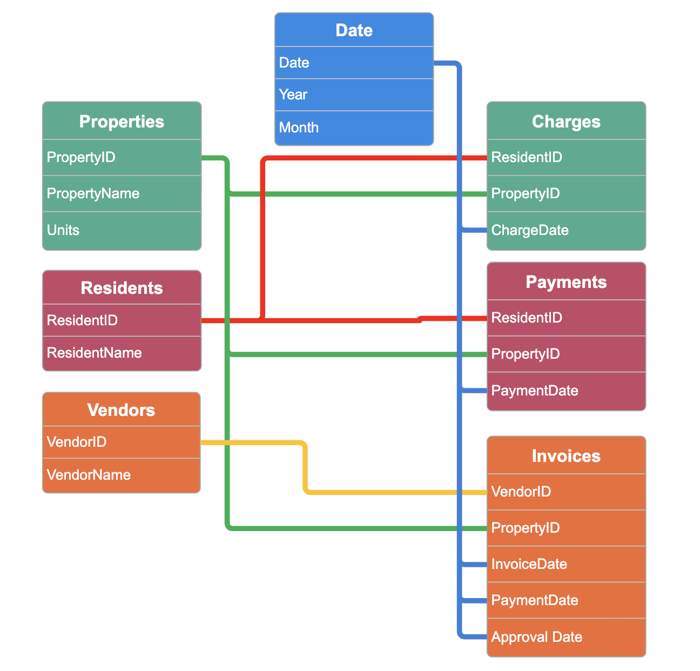

# Background and Overview
This project simulates a real-world multifamily property management portfolio consisting of 10 lease-up properties operating from 2025–2026 across major Florida markets (Miami, Orlando, Tampa, and Jacksonville). The term "lease-up" refers to the phase when a newly built rental property hits the market for the first time. They are "leasing up" to a stabalized occupancy.

The objecive of this analaysis is to evaluate:

- **Financial Performance:** NOI, revenue, & expenses
- **Accounts Receivable/Collections:** Revenue integrity
- **Accounts Payable/Expenses:** Vendor Spending and invoice management
- **Leasing Performance:** Occupancy Rate

An interactive PowerBI dashboard can be found here [link].

# Data Structure Overview
The data tables utilized consist of 7 tables with a total row count of 4,160 records.

The Entity Relationship Diagram above is included in the report illustrates:

- Primary and froeign key relationships
- One-to-many cardinality
- Separation of transactional and descriptive entities
- Referential integrity across financial processes

This dataset was AI-generated to simulate realistic multifamily operational data.
Light data preparation steps included:

- Resolving cases where a single ResidentID was incorrectly associated with multiple properties
- Validating that MoveOutDate > MoveInDate in the residents data table
- Standardizing date fields for time intelligence calculations
- Ensuring consistent property assignments across charges and payments
These adjustments ensured logical integrity before financial and occupancy modeling began.

# Executive Summary

Across the two-year period (2025–2026), the portfolio is operating at a negative **Net Operating Income (NOI).** The factor contributing to this is a **Total Expense** amount that is higher than the **Total Revenue** amount. The analysis of each of these values will give insight on where improvements can be made to correct this imbalance. Below is the overview page which indicates that this negative trend has been consistent over the two year data of these lease up properties..This is not specific to just one of the properties, rather they all are operating at a loss.

[insert photo 1 here]

# Notable Insights

### Revenue Integrity:

* **Collection Rates are generally stable.** While some properties experience minor fluctuations, there is no consistent downward trend or portfolio-wide delinquency pattern.

* **Collection Rates are generally stable.** Out of the **$1.52M** of total revenue, **$101.26K** is the amount of unpaid charges.; As described below in the accounts receivable card. Revenue leakage is not the primary driver of negative NOI with the overall collection rate at **93.32%.**

[insert photo 2 here]
*Included in this page of the dashboard is a metric that uses average monthly rent and total units in a property to calculate the projected monthly and annual revenue at 100% occupancy. This gives insight on the potential operating revenue of these properties.*

### Leasing Performance:

* **Occupancy levels remain severely below stabilized thresholds.** The Occupancy percentage is calculated using Move-In and Move-Out dates to reflect active tenancy over time. Please refer to visualization above. The total occupancy for all properties sits at a low **10.7%.**

* **Leasing systems/procedures are not effective.** Move-ins do not consistently exceed move-outs at a pace sufficient to offset operating costs. Leasing velocity is insufficient to support the current expense structure.

### High Vendor Expenses:

* **Invoice lifecycle is healthy.** The average number of days to approve an invoice is **3.42 days** and the average number to pay an invoice is **9.96 days.** These are reasonable payment processing durations.

* **Operating expenses are disproportionately high compared to revenue at current occupancy levels.** Expense Efficiency chart compares the expense ratio (Total Expenses / Total Revenue) to occupancy. This low of a volume of residents does not warrant the high operating expenses

* **Vendor categories.** Top category spending: **cleaning, repairs, and utilities.** The total expenses for these categories usually increase with the number of residents occupyinng a property. Properties with healthy occupancies require constant unit "turns" and preperation for new residents which drive up repair and cleaning costs.

[insert photo 3 here]
[insert photo 4 here]

* **Trends accross properties.**  Expense levels are consistently elevated across properties in the region, suggesting this is not an isolated property issue. In conclusion, cost structure appears oversized relative to asset stabilization stage.

# Recommendations
Based on the insights and findings above, I would recommend to consider the following: 

* **Review Leasing Systems & Conversion Funnel:**
  - Leasing traffic-to-lease conversion metrics.
  - Evaluate pricing strategy relative to submarket competitors
  - Assess concession impact on revenue stabilization.

* **Investigate Expense Controls:**
  - Conduct vendor contract benchmarking.
  - Review preventive maintenance scheduling.
  - Evaluate utility cost controls and consumption patterns.
 
* **Perform Regional Benchmarking:**
  - Compare leasing velocity and expense ratios against other regions or states.
  - Identify whether market-specific variables are influencing cost structure or lease-up speed

# Assumptions and Caveats
Throughout the analysis, multiple assumptions were made to manage challenges with the data. These assumptions and caveats are noted below:
- One resident is assumed to represent one occupied unit for occupancy modeling purposes.
- Revenue projections use blended average rental rates per property.
- Operating expenses are treated as largely fixed in the short term for stabilization analysis.

# Tools & Technologies
- Power BI
- DAX (Data Analysis Expressions)
- Star Schema Modeling
- Time Intelligence Calculations
- Conditional Formatting & Advanced Visuals
